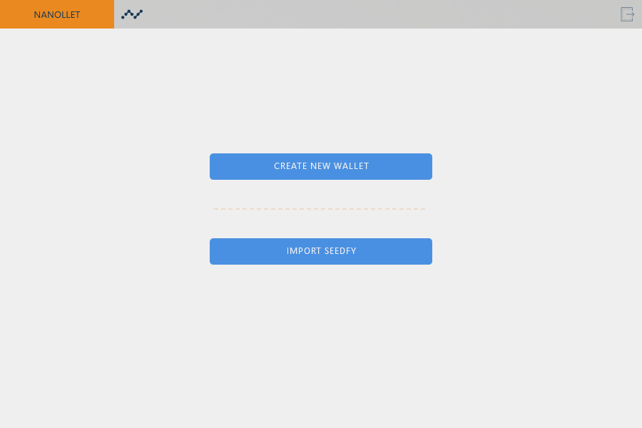

# Nanollet

Nanollet is decentralized, easy to use and secure! The wallet needs less than 20MB of disk space and doesn't need a centralized server.

----------

### Wiki

In the wiki you can find some resources about Nanollet, or any app that is supported.

----------

###  Available features:

*Yes, you can send and receive payments, just like any other wallet. However, we have more features developed for Nanolet.*

#### Apps:

- **Nanofy:** 
That allows you to sign one file, or arbitrary data, using Nano. This is so easy, simple and fast to be verified, also it’s almost free.

- **Nanollet 2FA**:
You can only send one transaction with hold your mobile phone. If someone stole one of your keys they don’t have the ability to move your money. It’s not secure as the multi-sig, but better than a password alone.

- **OpenCAP**
You can send money using a OpenCAP alias, for instance send money using nanollet$ogdolo.com. You can create a alias using any provider (like [ogdolo.com](https://ogdolo.com)) and the Nanollet will discover the address and send the funds.

- **NanoAlias**:
You can create your own alias inside the wallet, stored on the blockchain and without any centralized server. With this alias is possible to receive money by using a simple @nanollet, rather than use xrb_3tz9pdfskx934ce36cf6h17uspp4hzsamr5hk7u1wd6em1gfsnb618hfsafc.

#### Internal:

- **SeedFY:** 
That is the secure seed. The SeedFY can be considered as one part of your seed that combines with your password to generate the seed. Because of that, holding only the SeedFY doesn’t guarantee access to your funds in isolation.

---------

### Support the project:

If you like the project you can help it gets better and better. We really need people to review the code, searching for flaws or security issues, also to improve the code in general.

However, donations are accepted under **xrb_3tz9pdfskx934ce36cf6h17uspp4hzsamr5hk7u1wd6em1gfsnb618hfsafc**, or **@nanollet** or **nanollet$ogdolo.com**. ;)

